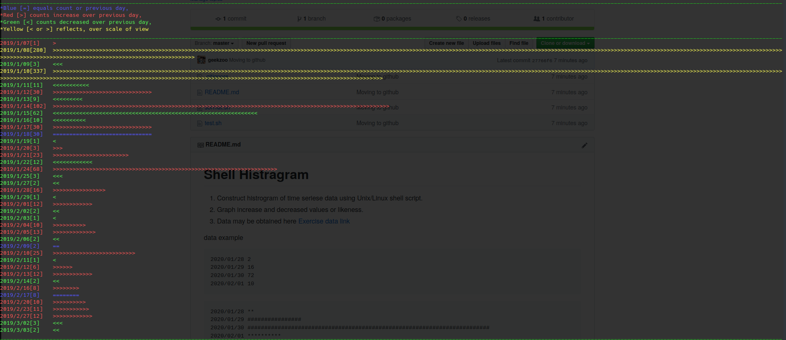

# Shell Histragram

1. Construct histrogram of time seriese data using Unix/Linux shell script.
1. Graph increase and decreased values or likeness.

Usage `./somat.sh mydata.txt`

data example

```data
2020/01/28 2
2020/01/29 16
2020/01/30 72
2020/02/01 10
```

```data
2020/01/28 **
2020/01/29 ################
2020/01/30 ########################################################################
2020/02/01 **********
```



- [x] read data
- [x] graph data
- [ ] automated tests
- [ ] spell check :)
